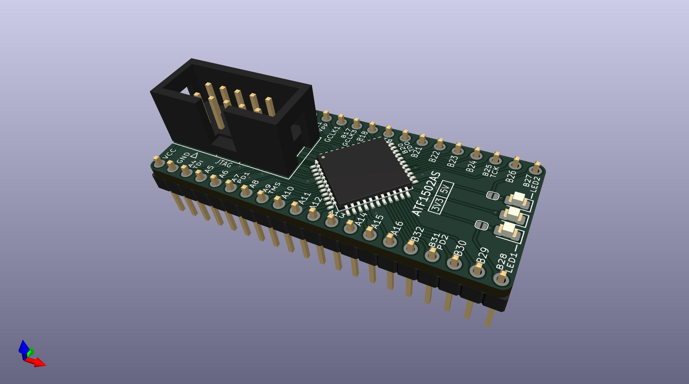
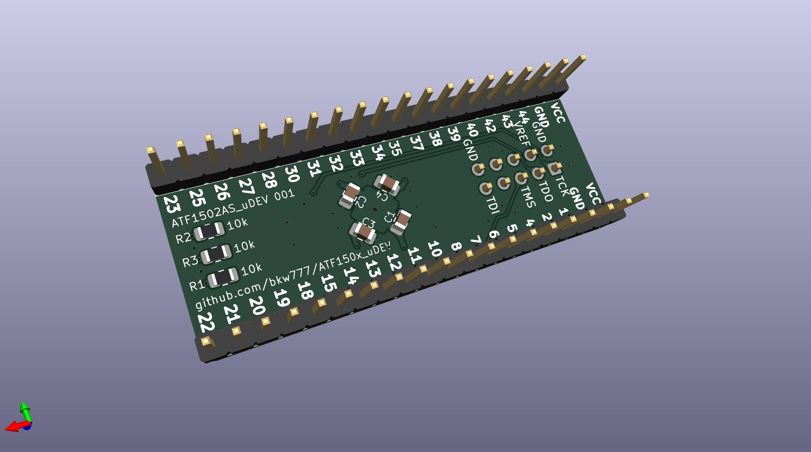
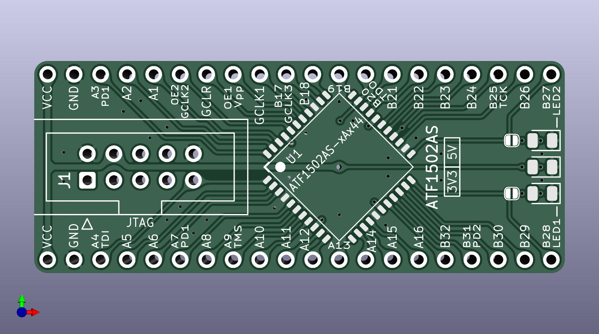
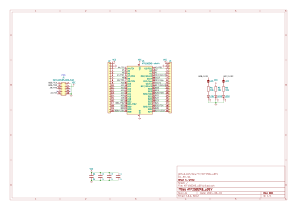
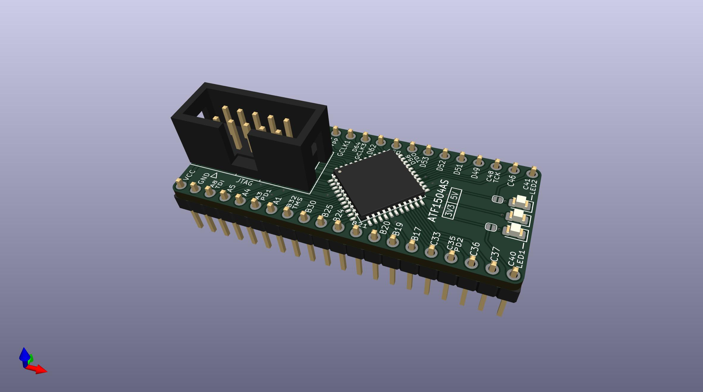
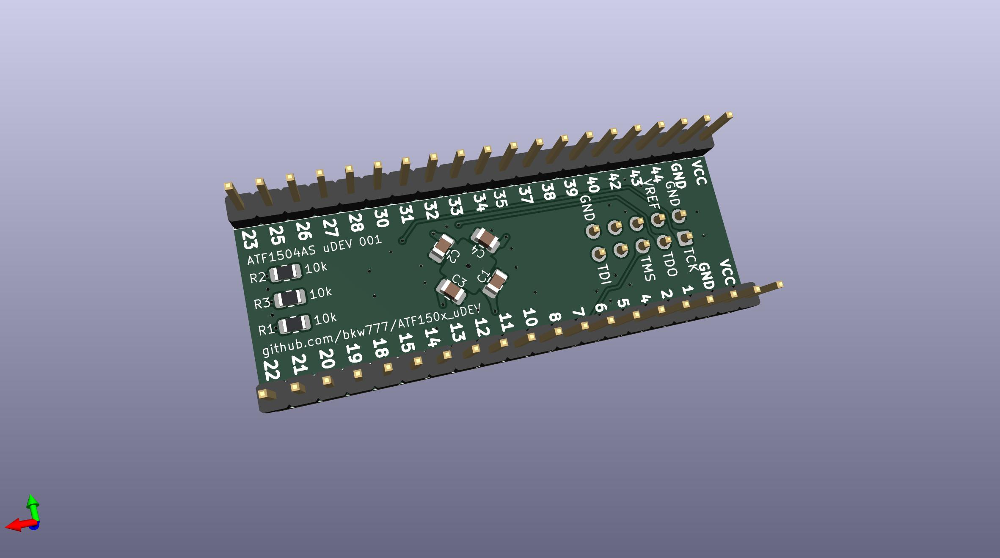
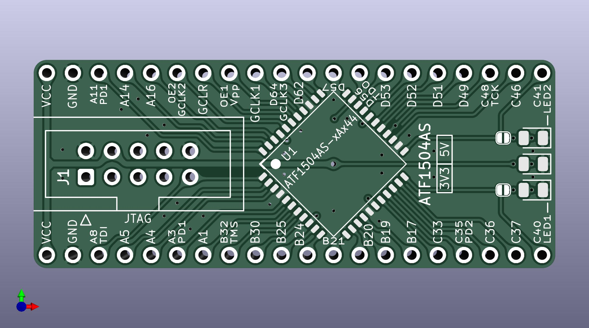
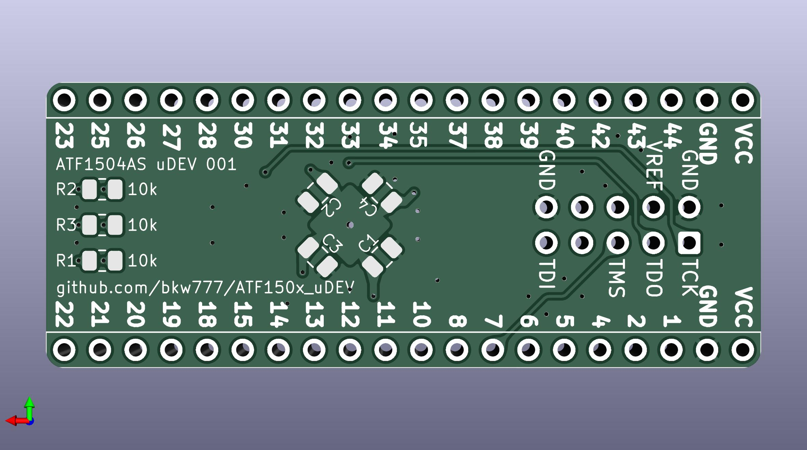

# ATF150x_uDEV

Tiny dev boards for Atmel/Microchip ATF1502AS(V)(L)-xAx44 & ATF1504AS(V)(L)-xAx44.  
(32 or 64 macrocell, 5V or 3V3, standard or low power, TQFP-44)

Modified from https://github.com/whitequark/ATF15xx-EVB

There are 2 PCB versions, one for ATF1502 and one for ATF1504.  
The only difference is the silkscreen pin labels.

Features:
* smaller pcb, 0.6 inch DIP-40 footprint
* standard 10-pin Atmel jtag port
* all traces surrounded by ground
* pin labels show the macrocell number & group and alt function

Use 220n to 1u for C1-C4

## ATF1502AS

## ATF1504AS

