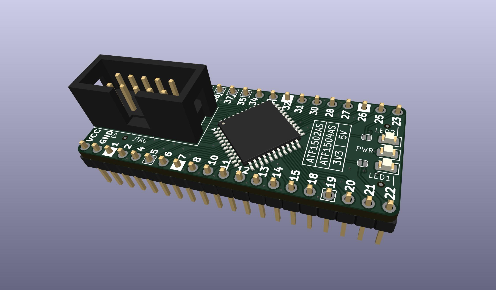
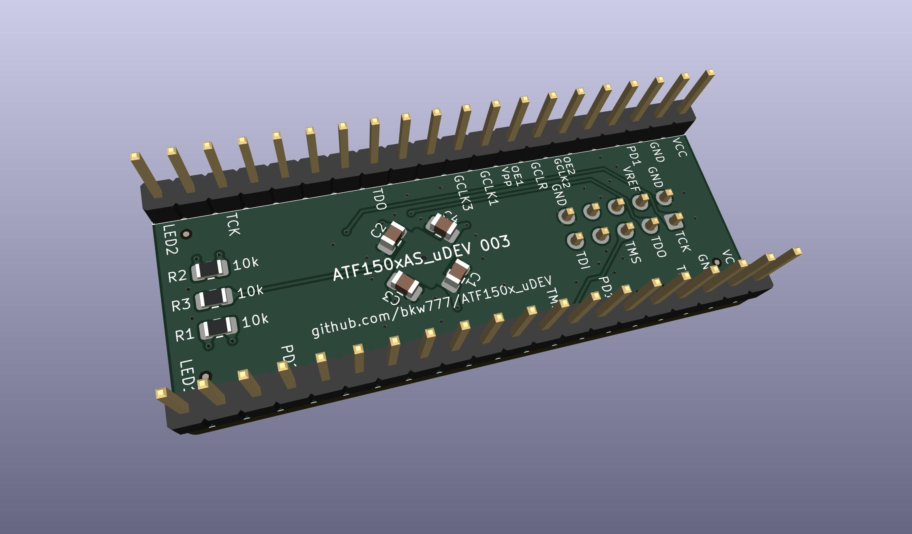
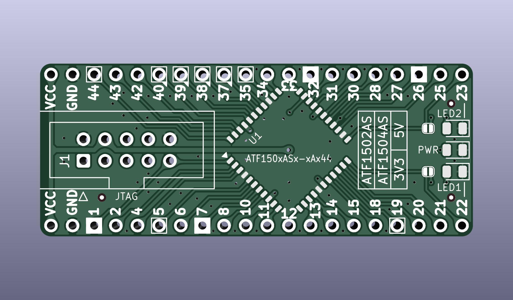
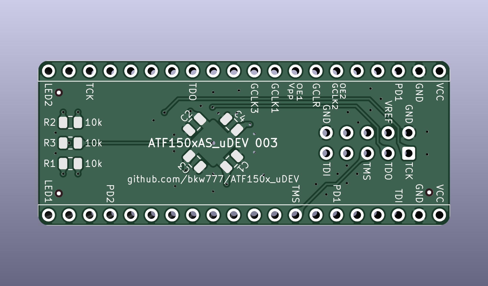
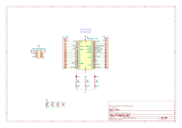

# ATF150x_uDEV

Tiny dev board for Atmel/Microchip ATF1502AS(V)(L)-xAx44 & ATF1504AS(V)(L)-xAx44.  
(32 or 64 macrocell, 5V or 3V3, standard or low power, TQFP-44)

Modified from https://github.com/whitequark/ATF15xx-EVB

Use 220n to 1u for C1-C4

<!--
## Programming  
Still a work in progress.

Perhaps this hardware: https://github.com/hackup/ATF2FT232HQ

Perhaps this software: https://snowgoons.ro/posts/2020-11-25-atf15xx-vhdl-development-for-cheap/

Supposedly there is a way to use openocd too, but the openocd docs are confusing.  
Need actual sample commands to start from...  
`openocd -c "adapter driver list"`

-->