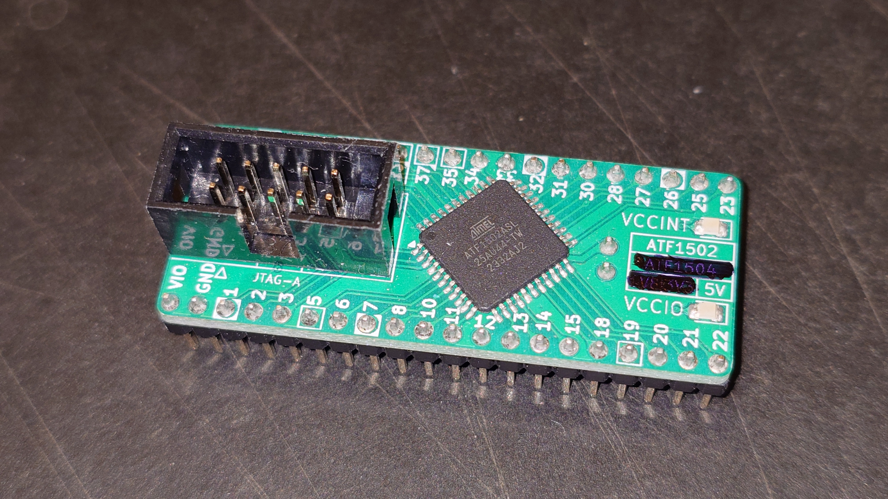
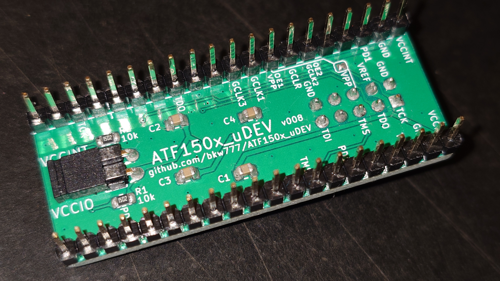
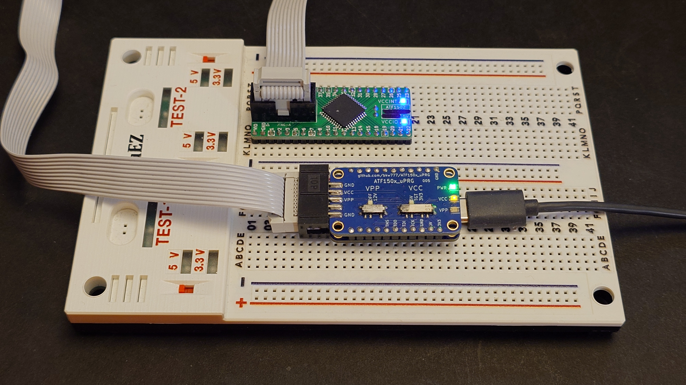
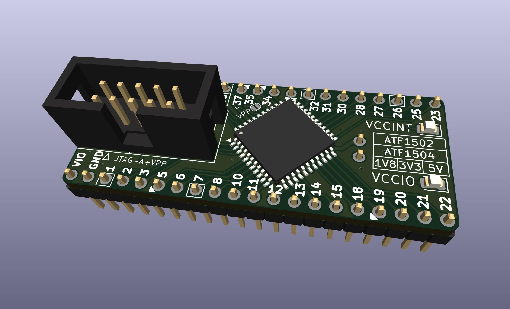
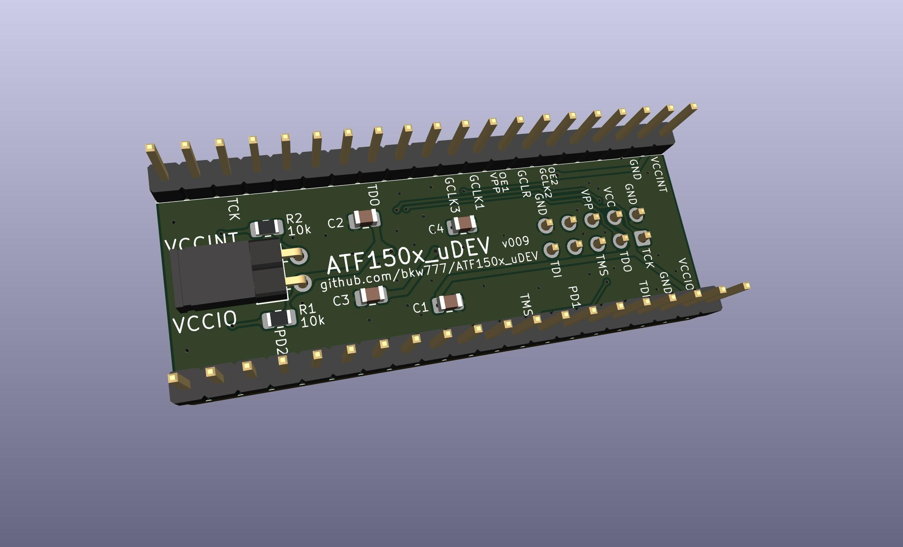
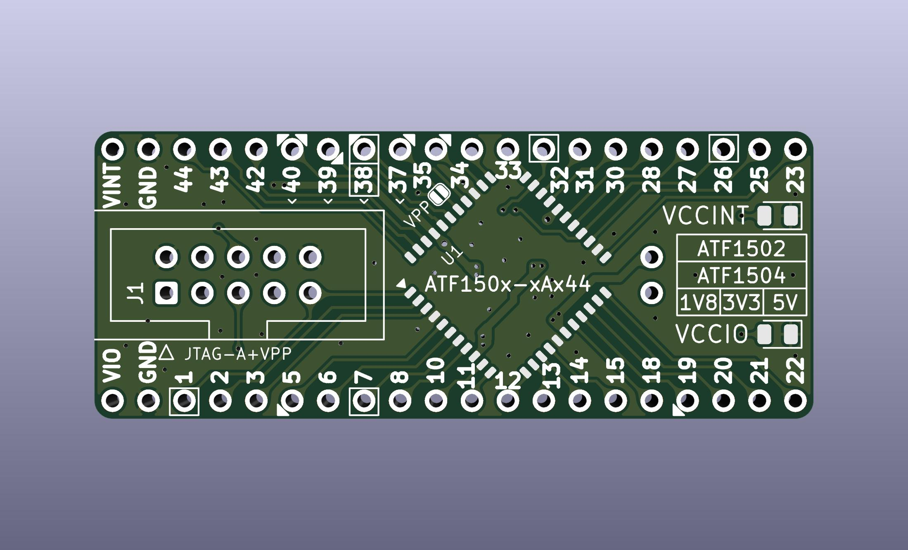
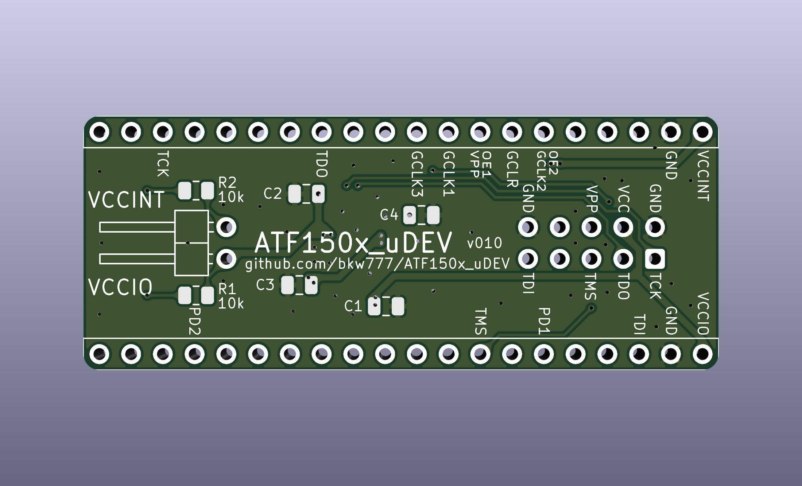
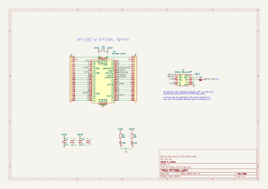

# ATF150x_uDEV

Tiny dev board for Atmel/Microchip ATF1502 & ATF1504 TQFP-44.

For C1-C4 use anything from 0.22u to 1u.

JTAG pin 6 may optionally be connected to IC pin 38 (OE1#/VPP) by the VPP solder jumper.  
[ATF150x_uPRG](https://github.com/bkw777/ATF150x_uPRG) has a matching option to output 12v VPP on JTAG pin 6.  
<!-- 
VPP is only needed if the chip is currently programmed with gateware that disables jtag.  
NOTE: VPP does NOT overcome the secure programming option!  
-->

# Programming
[Buckle Up!](programming.md)

<!--

https://github.com/hoglet67/atf15xx_yosys

https://github.com/roscopeco/atfprog-tools

https://github.com/hackup/ATF2FT232HQ

https://snowgoons.ro/posts/2020-11-25-atf15xx-vhdl-development-for-cheap/

https://www.eevblog.com/forum/fpga/atmel-atf150x-cpld-and-wincupl/

https://www.eevblog.com/forum/microcontrollers/freeopen-source-alternative-to-wincupl/

http://forum.6502.org/viewtopic.php?f=10&t=7920

dev kit
https://www.digikey.com/en/products/detail/microchip-technology/ATF15XX-DK3-U/5235981

prochip license 2 years $840
https://www.digikey.com/en/products/detail/microchip-technology/ATDS15XXKSW1/1596666

prochip cd $300 maybe just the cd same as the download? functional? not?
https://www.digikey.com/en/products/detail/microchip-technology/ATDS1500PC/524057?s=N4IgTCBcDaIA4CcD2BjAFgSziAugXyA

-->

# Credits
Modified originally from [whitequark/ATF15xx-EVB](https://github.com/whitequark/ATF15xx-EVB)
