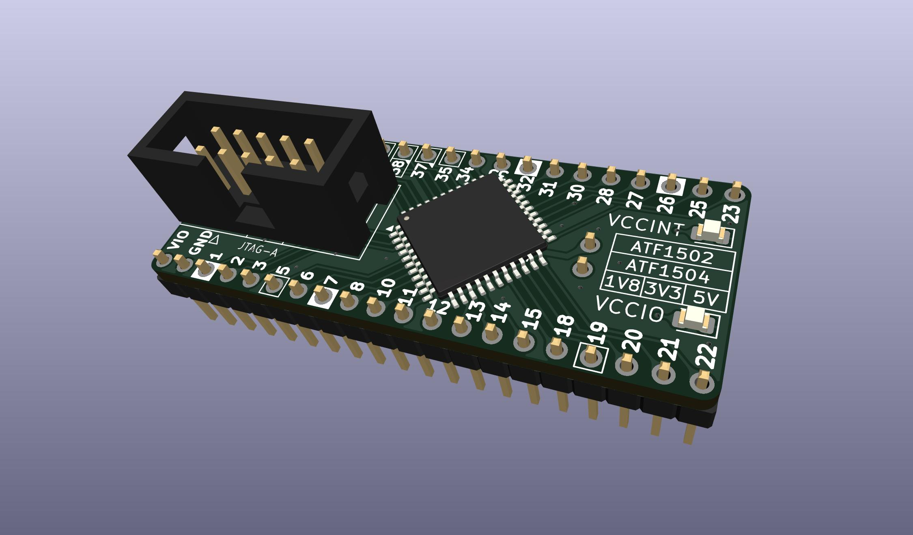
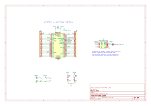

# ATF150x_uDEV

Tiny dev board for Atmel/Microchip ATF1502 & ATF1504 TQFP-44.

Modified from https://github.com/whitequark/ATF15xx-EVB

Use 220n to 1u for C1-C4

<!--
## Programming  
Still a work in progress.  
Some links to investigate further.  

https://github.com/roscopeco/atfprog-tools

https://github.com/hackup/ATF2FT232HQ

https://snowgoons.ro/posts/2020-11-25-atf15xx-vhdl-development-for-cheap/

openocd docs are confusing.  
Need actual example commands to start from...  
`openocd -c "adapter driver list"`

-->