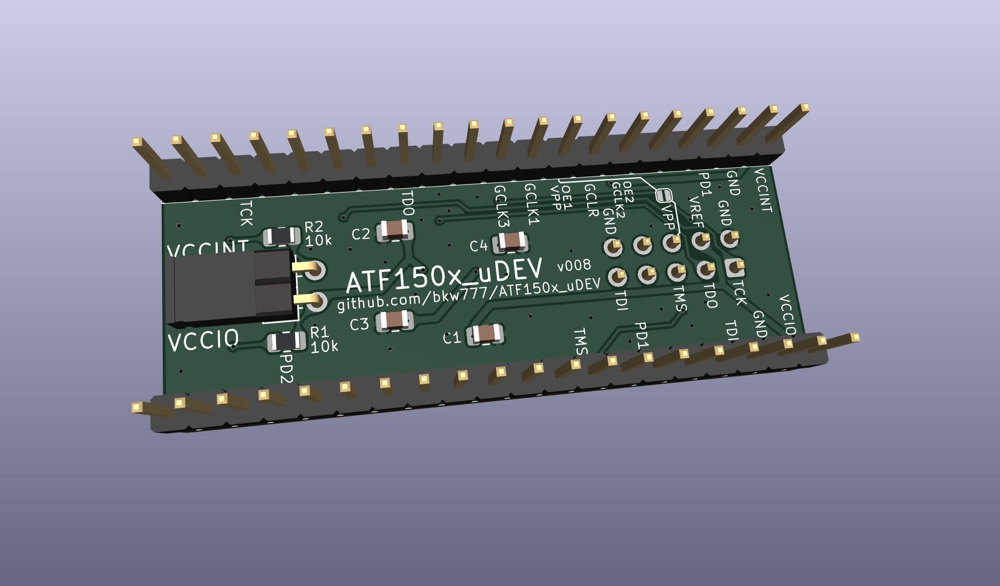

# ATF150x_uDEV

Tiny dev board for Atmel/Microchip ATF1502 & ATF1504 TQFP-44.

For C1-C4 use anything from 220n to 1u.

JTAG pin 6 may optionally be connected to VPP by a solder jumper.

[bkw777/FT232H-ATF150x](https://github.com/bkw777/FT232H-ATF150x) has a matching JTAG-A+VPP option to supply the 12v VPP over the JTAG cable.

<!--
## Programming  
Still a work in progress.  
Some links to investigate further.  

https://github.com/roscopeco/atfprog-tools

https://github.com/hackup/ATF2FT232HQ

https://snowgoons.ro/posts/2020-11-25-atf15xx-vhdl-development-for-cheap/

openocd docs are confusing.  
Need actual example commands to start from...  
`openocd -c "adapter driver list"`

-->

# Credits
Modified originally from [whitequark/ATF15xx-EVB](https://github.com/whitequark/ATF15xx-EVB)
