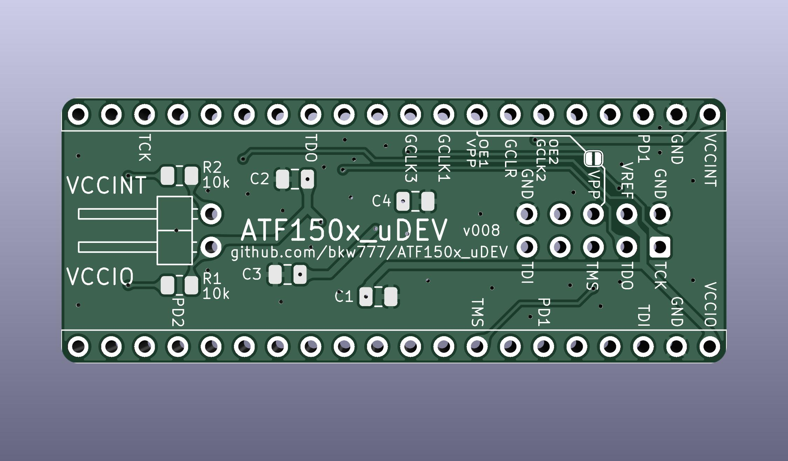

# ATF150x_uDEV

Tiny dev board for Atmel/Microchip ATF1502 & ATF1504 TQFP-44.

For C1-C4 use anything from 220n to 1u.

JTAG pin 6 may optionally be connected to IC pin 38 (OE1#/VPP) by a solder jumper.

[bkw777/ATF150x_uPRG](https://github.com/bkw777/ATF150x_uPRG) has a matching JTAG-A+VPP option to supply the 12v VPP via JTAG pin 6.

# Programming
[Buckle Up!](programming.md)

<!--

https://github.com/hoglet67/atf15xx_yosys

https://github.com/roscopeco/atfprog-tools

https://github.com/hackup/ATF2FT232HQ

https://snowgoons.ro/posts/2020-11-25-atf15xx-vhdl-development-for-cheap/

https://www.eevblog.com/forum/fpga/atmel-atf150x-cpld-and-wincupl/

https://www.eevblog.com/forum/microcontrollers/freeopen-source-alternative-to-wincupl/

http://forum.6502.org/viewtopic.php?f=10&t=7920

-->

# Credits
Modified originally from [whitequark/ATF15xx-EVB](https://github.com/whitequark/ATF15xx-EVB)
